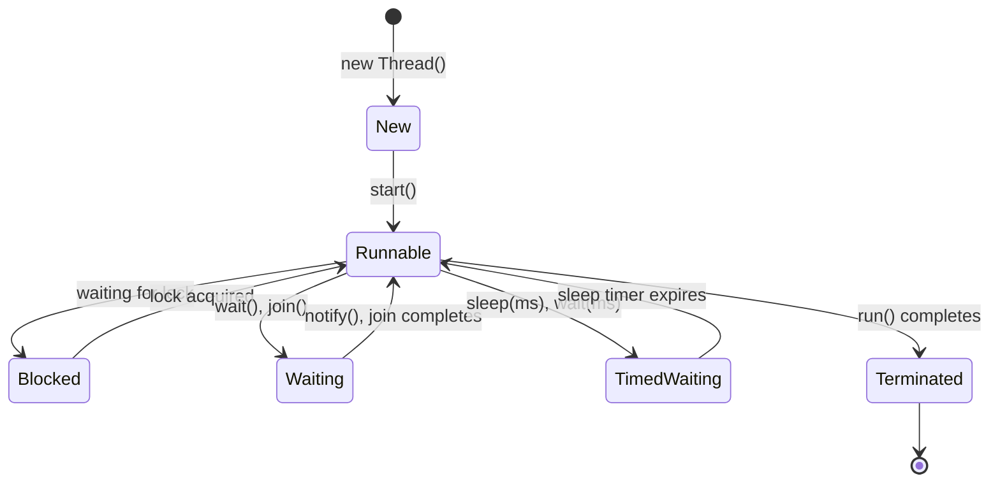

# Java Multithreading - A Comprehensive Guide

Multithreading is a Java feature that allows concurrent execution of two or more parts of a program for maximum utilization of the CPU. Each part of such a program is called a thread. Threads are lightweight processes within a process.

---

## 1. Core Concepts: Process vs. Thread

- **Process**: An executing program with its own memory space (heap, stack, etc.) allocated by the Operating System. Processes are heavy-weight and costlier to create/destroy.
- **Thread**: A subset of a process that shares the process's memory and resources. Threads are lightweight units of execution, and context switching between threads is faster than between processes.

---

## 2. Creating Threads in Java

There are two primary methods to define and instantiate threads in Java, along with a modern shortcut (lambda expression):

### Method A: Extending the `Thread` Class
1. Inherit from the `java.lang.Thread` class.
2. Override the `run()` method to specify the code that the thread executes.
3. Call `start()` on the thread object to begin its execution.

```java
class MyThread extends Thread {
    @Override
    public void run() {
        System.out.println("Thread running: " + getName());
    }
}

// In main method:
MyThread t1 = new MyThread();
t1.start(); // Starts execution asynchronously
```

### Method B: Implementing the `Runnable` Interface
1. Implement the `java.lang.Runnable` interface.
2. Define the `run()` method.
3. Pass the `Runnable` instance to a `Thread` constructor, then call `start()`.

```java
class MyRunnable implements Runnable {
    @Override
    public void run() {
        System.out.println("Runnable running: " + Thread.currentThread().getName());
    }
}

// In main method:
Thread t2 = new Thread(new MyRunnable());
t2.start();
```

### Method C: Using Lambda Expressions (Java 8+)
Since `Runnable` is a functional interface (it has only one abstract method: `run()`), you can use lambda expressions to write compact thread code:
```java
Thread t3 = new Thread(() -> {
    System.out.println("Lambda thread running");
});
t3.start();
```

### Comparison: Thread Class vs. Runnable Interface
- **Runnable Interface (Preferred)**: Since Java supports only single inheritance, implementing `Runnable` leaves your class free to inherit/extend another class. It also decouples the task logic from the thread runner mechanism.
- **Thread Subclass**: Good for quick, simple tasks, but limits further subclassing.

---

## 3. Thread Lifecycle States
A thread can exist in one of the following states (defined in `Thread.State` enum):



1. **NEW**: A thread that has been created but not yet started (before calling `start()`).
2. **RUNNABLE**: A thread executing in the JVM (or waiting for operating system resources like processor allocation).
3. **BLOCKED**: A thread waiting for a monitor lock to enter or re-enter a synchronized block/method.
4. **WAITING**: A thread waiting indefinitely for another thread to perform a specific action (e.g., via `object.wait()` or `thread.join()`).
5. **TIMED_WAITING**: A thread waiting for a specified waiting time (e.g., via `Thread.sleep(millis)` or `object.wait(millis)`).
6. **TERMINATED**: A thread that has completed execution of its `run()` method.

---

## 4. Key Thread Methods

| Method | Syntax | Description |
| :--- | :--- | :--- |
| `start()` | `void start()` | Causes this thread to begin execution; the JVM calls the `run` method of this thread. |
| `run()` | `void run()` | Contains the entry point code for the thread's execution. |
| `sleep()` | `static void sleep(long millis)` | Suspends the currently executing thread for the specified number of milliseconds (throws checked `InterruptedException`). |
| `join()` | `void join()` | Waits for the thread on which it is called to die/finish. |
| `yield()` | `static void yield()` | A hint to the scheduler that the current thread is willing to yield its current use of a processor. |
| `interrupt()` | `void interrupt()` | Interrupts the thread. If the thread is blocked in a method like `sleep()`, it throws `InterruptedException`. |
| `isAlive()` | `boolean isAlive()` | Tests if this thread is alive (started and not yet terminated). |

---

## 5. Thread Priorities and Daemon Threads

### Thread Priorities
Every thread has a priority represented by an integer from 1 to 10. The thread scheduler schedules threads based on their priority. However, thread priority is not guaranteed because scheduler implementations vary across OS platforms.
- `Thread.MIN_PRIORITY` (value: 1)
- `Thread.NORM_PRIORITY` (value: 5 - default)
- `Thread.MAX_PRIORITY` (value: 10)

```java
thread.setPriority(Thread.MAX_PRIORITY);
```

### Daemon Threads
Daemon threads are background provider threads that serve user threads. 
- **Key Property**: The JVM will terminate itself when all non-daemon user threads finish execution, regardless of whether daemon threads are still running.
- **Example**: Garbage Collector (GC) is a daemon thread.
- **Usage**:
  ```java
  Thread t = new Thread(runnable);
  t.setDaemon(true); // Must be called before starting the thread!
  t.start();
  ```

---

## 6. Concurrency Issues & Synchronization

### The Problem: Race Conditions
When multiple threads read and write to shared variables concurrently, their actions might overlap, leading to inconsistent or incorrect data. This is known as a **race condition**.

### The Solution: Synchronization
Synchronization in Java ensures that only one thread can access a shared resource at any given time. This is achieved using the `synchronized` keyword, which utilizes intrinsic locks (monitors).

#### A. Synchronized Methods
Locks the entire instance (for non-static methods) or the Class object (for static methods):
```java
public synchronized void increment() {
    counter++;
}
```

#### B. Synchronized Blocks
Locks only a specific section of code, allowing more granular concurrency:
```java
public void increment() {
    // Only lock the critical section using a specific lock object
    synchronized(this) {
        counter++;
    }
}
```

---

## 7. Inter-Thread Communication
Inter-thread communication allows synchronized threads to communicate with each other using methods defined in the root `Object` class:

- **`wait()`**: Tells the current thread to release the lock and go to sleep until another thread calls `notify()` or `notifyAll()`.
- **`notify()`**: Wakes up a single thread that is waiting on this object’s monitor.
- **`notifyAll()`**: Wakes up all threads waiting on this object's monitor.

> [!IMPORTANT]
> These methods (`wait`, `notify`, `notifyAll`) can **only** be invoked from within a `synchronized` context (method or block). Otherwise, they throw an `IllegalMonitorStateException`.
